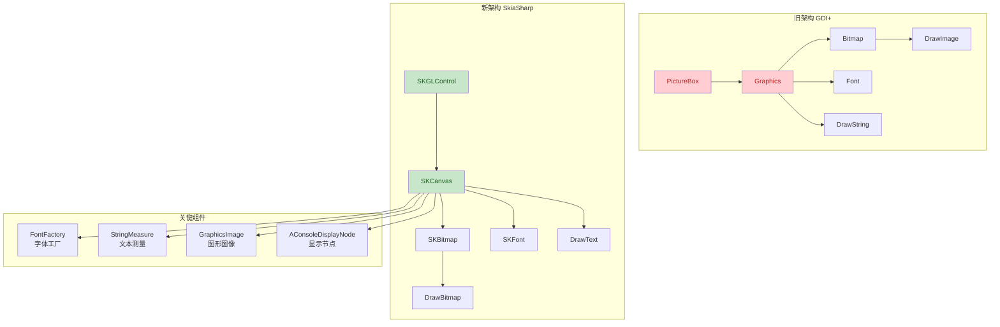

## 1. 高层摘要 (TL;DR)

*   **影响级别:** 🔴 **高** - 核心图形渲染引擎重构
*   **变更范围:** 将整个Emuera项目的图形渲染从System.Drawing/GDI+迁移到SkiaSharp跨平台图形库
*   **关键变更:**
    *   ✅ 添加SkiaSharp 2.88.3依赖包
    *   ✅ 核心图形类型替换（Bitmap→SKBitmap, Graphics→SKCanvas, Font→SKFont）
    *   ✅ EraPictureBox从PictureBox迁移到SKGLControl
    *   ✅ 实现字体回退机制（Font Fallback）
    *   ✅ 重构所有绘制方法签名和实现

---

## 2. 可视化概览 (架构变更图)



---

## 3. 详细变更分析

### 📦 3.1 项目依赖变更

| 包名 | 旧版本 | 新版本 | 说明 |
|------|--------|--------|------|
| SkiaSharp | - | 2.88.3 | 新增：跨平台2D图形库 |
| SkiaSharp.Views.WindowsForms | - | 2.88.3 | 新增：Windows Forms集成 |

**源文件:** `Emuera/Emuera.csproj`

---

### 🎨 3.2 核心图形类型替换

#### 3.2.1 图像和画布类型

| 旧类型 | 新类型 | 影响文件数 |
|--------|--------|-----------|
| `System.Drawing.Bitmap` | `SkiaSharp.SKBitmap` | 15+ |
| `System.Drawing.Graphics` | `SkiaSharp.SKCanvas` | 10+ |
| `System.Drawing.Font` | `SkiaSharp.SKFont` | 8+ |

**关键变更示例:**

```csharp
// 旧代码
public Bitmap Bitmap { get; set; }
protected Graphics g;

// 新代码
public SKBitmap SKBitmap { get; set; }
protected SKCanvas canvas;
```

**源文件:** 
- `Emuera/UI/Game/image/AImage.cs`
- `Emuera/UI/Game/image/ConstImage.cs`
- `Emuera/UI/Game/image/GraphicsImage.cs`

---

#### 3.2.2 绘制方法签名变更

所有显示节点的`DrawTo`方法签名已统一更改：

```csharp
// 旧签名
public abstract void DrawTo(Graphics graph, int pointY, bool isSelecting, bool isFocus, bool isBackLog, TextDrawingMode mode, bool isButton = false);

// 新签名
public abstract void DrawTo(SKCanvas graph, SKPoint point, bool isSelecting, bool isFocus, bool isBackLog, TextDrawingMode mode, bool isButton = false);
```

**影响文件:**
- `Emuera/UI/Game/AConsoleDisplayNode.cs`
- `Emuera/UI/Game/ConsoleStyledString.cs`
- `Emuera/UI/Game/ConsoleImagePart.cs`
- `Emuera/UI/Game/ConsoleShapePart.cs`
- `Emuera/Runtime/Utils/EvilMask/ConsoleDivPart.cs`

---

### 🖼️ 3.3 UI控件重构

#### 3.3.1 EraPictureBox迁移

| 属性 | 旧实现 | 新实现 |
|------|--------|--------|
| 基类 | `PictureBox` | `SKGLControl` |
| 绘制事件 | `Paint` | `PaintSurface` |
| 事件参数 | `PaintEventArgs` | `SKPaintGLSurfaceEventArgs` |

**源文件:** `Emuera/UI/Framework/Forms/EraPictureBox.cs`

```csharp
// 旧代码
internal sealed class EraPictureBox : PictureBox
{
    protected override void OnPaintBackground(PaintEventArgs pevent) { }
}

// 新代码
internal sealed class EraPictureBox : SKGLControl
{
    // 移除了所有GDI+相关的样式设置代码
}
```

#### 3.3.2 主窗口绘制事件

**源文件:** `Emuera/UI/Framework/Forms/MainWindow.cs`

```csharp
// 旧代码
private void mainPicBox_Paint(object sender, PaintEventArgs e)
{
    console.OnPaint(e.Graphics);
}

// 新代码
private void mainPicBox_Paint(object sender, SKPaintGLSurfaceEventArgs e)
{
    console.OnPaint(e.Surface.Canvas);
}
```

---

### 🔤 3.4 字体系统重构

#### 3.4.1 FontFactory更新

**源文件:** `Emuera/UI/FontFactory.cs`

| 方法 | 旧实现 | 新实现 |
|------|--------|--------|
| 字体缓存类型 | `Dictionary<(string, int, FontStyle), Font>` | `Dictionary<(string, float, FontStyle), SKFont>` |
| 字体创建 | `new Font(name, size, style, GraphicsUnit.Pixel)` | `new SKFont(SKTypeface.FromFamilyName(name), size)` |

#### 3.4.2 字体回退机制 (Font Fallback)

**源文件:** `Emuera/UI/Game/ConsoleStyledString.cs`

新增了字体回退功能，当主字体不支持某些字符时自动切换到备用字体：

```csharp
// 新增字段
SKFont _fallbackFont;
List<TextsWithFont> _texts;

// 字符分割逻辑
if (!Font.ContainsGlyphs(Text))
{
    _fallbackFont = FontFactory.GetFont(Config.DefaultFont.Typeface.FamilyName, style.FontStyle);
    // 按字符分割，为每个字符选择合适的字体
}
```

---

### 📏 3.5 文本测量重构

**源文件:** `Emuera/UI/Game/StringMeasure.cs`

| 变更项 | 旧实现 | 新实现 |
|--------|--------|--------|
| 类类型 | 实例类（需创建Graphics对象） | 静态工具类 |
| 测量方法 | `TextRenderer.MeasureText` / `Graphics.MeasureString` | `SKPaint.MeasureText` |
| 性能优化 | 需要预先创建Graphics | 直接使用SKPaint |

```csharp
// 旧代码
internal sealed class StringMeasure : IDisposable
{
    readonly Graphics graph;
    readonly Bitmap bmp;
    public int GetDisplayLength(string s, Font font) { ... }
}

// 新代码
internal sealed class StringMeasure : IDisposable
{
    public static int GetDisplayLength(ReadOnlySpan<char> chars, SKFont f)
    {
        using var paint = new SKPaint();
        paint.Typeface = f.Typeface;
        paint.TextSize = f.Size;
        return (int)paint.MeasureText(chars.ToString());
    }
}
```

---

### 🖌️ 3.6 图像绘制API映射

| GDI+方法 | SkiaSharp方法 | 说明 |
|----------|---------------|------|
| `DrawImage(bitmap, x, y)` | `DrawBitmap(bitmap, x, y)` | 绘制位图 |
| `DrawString(text, font, brush, point)` | `DrawText(text, x, y, font, paint)` | 绘制文本 |
| `FillRectangle(brush, rect)` | `DrawRect(rect, paint)` | 填充矩形 |
| `DrawLine(pen, x1, y1, x2, y2)` | `DrawLine(x1, y1, x2, y2, paint)` | 绘制线条 |
| `SetClip(rect, mode)` | `ClipRect(rect)` | 设置裁剪区域 |
| `ResetClip()` | `Restore()` | 重置裁剪 |

**源文件:** `Emuera/UI/Game/image/GraphicsImage.cs`

---

### 🎯 3.7 颜色系统适配

新增了扩展方法在`System.Drawing.Color`和`SkiaSharp.SKColor`之间转换：

```csharp
// 使用示例
Color sysColor = Config.BackColor;
SKColor skColor = sysColor.ToSKColor();

// 反向转换
Color drawingColor = skColor.ToDrawingColor();
```

**源文件:** 多个文件中使用了这些转换方法

---

### 📊 3.8 配置类变更

**源文件:** `Emuera/Runtime/Config/Config.cs`

```csharp
// 旧代码
public static Font Font;
public static Font DefaultFont { get { return FontFactory.GetFont("", FontStyle.Regular); } }

// 新代码
public static SKFont Font;
public static SKFont DefaultFont { get { return FontFactory.GetFont("", FontStyle.Regular); } }
```

---

### 🖼️ 3.9 图像加载方式变更

| 旧方法 | 新方法 | 说明 |
|--------|--------|------|
| `Utils.LoadImage(filepath)` | `SKBitmap.Decode(filepath)` | 直接解码图像文件 |
| `new Bitmap(width, height)` | `new SKBitmap(width, height)` | 创建空白位图 |

**源文件:** 
- `Emuera/Runtime/Script/Statements/Function/Creator.Method.cs`
- `Emuera/UI/Game/image/AppContents.cs`
- `Emuera/UI/Game/image/ConstImage.cs`

---

## 4. 影响与风险评估

### ⚠️ 4.1 破坏性变更

1.  **API签名变更:** 所有`DrawTo`方法的签名已更改，任何继承自`AConsoleDisplayNode`的自定义类都需要更新
2.  **类型不兼容:** `Bitmap`、`Graphics`、`Font`类型已完全替换，无法与旧代码混用
3.  **事件处理变更:** `Paint`事件已改为`PaintSurface`，事件参数类型不同

### 🔍 4.2 潜在风险

1.  **字体渲染差异:** SkiaSharp的字体渲染可能与GDI+有细微差异，可能导致文本布局变化
2.  **性能影响:** SkiaSharp在某些场景下性能可能优于或劣于GDI+，需要实际测试
3.  **像素操作:** 直接操作像素的代码（如`GetPixel`/`SetPixel`）需要确保颜色格式兼容
4.  **图像滤镜:** `ImageAttributes`和颜色矩阵的实现可能不完全等价

### ✅ 4.3 测试建议

1.  **文本渲染测试:**
    - 测试多语言文本显示（特别是中日韩混合文本）
    - 验证字体回退机制是否正常工作
    - 检查文本对齐和换行是否正确

2.  **图像处理测试:**
    - 测试各种格式图像的加载（PNG, JPEG, WebP等）
    - 验证图像缩放、旋转、裁剪功能
    - 测试透明度和颜色矩阵滤镜

3.  **性能测试:**
    - 对比重绘性能，特别是大量文本和图像的场景
    - 测试内存使用情况

4.  **兼容性测试:**
    - 测试现有的ERB脚本是否正常运行
    - 验证所有图形相关的脚本命令（如GCREATE, GDRAWTEXT等）

---

## 5. 技术亮点

✨ **字体回退机制:** 自动检测字符是否被字体支持，无缝切换到备用字体  
✨ **跨平台基础:** SkiaSharp为未来移植到Linux/Mac奠定了基础  
✨ **现代图形API:** SkiaSharp提供更好的硬件加速和性能优化  
✨ **代码简化:** 移除了许多GDI+特有的复杂代码（如双缓冲设置）

---

## 6. 迁移统计

| 指标 | 数量 |
|------|------|
| 变更文件数 | 28 |
| 新增依赖包 | 2 |
| 核心类型替换 | 3种（Bitmap/Font/Graphics） |
| 方法签名变更 | 1个（DrawTo） |
| UI控件迁移 | 1个（EraPictureBox） |